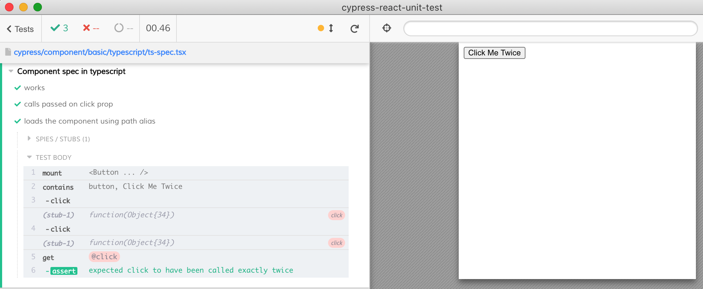

# typescript

You can write your components and specs using TypeScript if your preprocessor can transpile `.tsx` files, see `cypress/plugins` and `tsconfig.json` files. You can use path aliases provided you configure them in both [Webpack and tsconfig](https://glebbahmutov.com/blog/using-ts-aliases-in-cypress-tests/)

