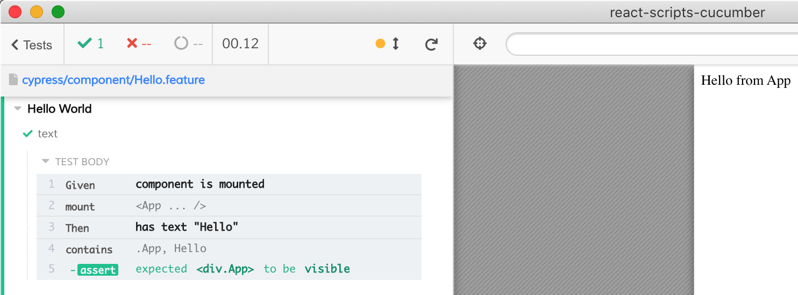

# example: react-scripts-cucumber

See tests in [cypress/component](cypress/component) folder

Example feature file [cypress/component/Hello.feature](cypress/component/Hello.feature)

```
Feature: Hello World
  Scenario: text
    Given component is mounted
    Then has text "Hello"
```

Is executed against a component


